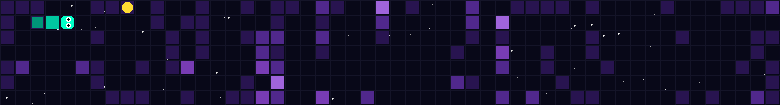

# GitHub Snake Contributions - Implementation Plan

## Overview

Build a Snake game that generates animated GIFs from GitHub contribution data, modeled after [gh-space-shooter](https://github.com/czl9707/gh-space-shooter) but with a Snake game twist.

**Tech Stack**: Python (with uv, Pillow, httpx)
**Default Mode**: Walls (contribution intensity → obstacles)
**GitHub Repo**: Will be created as `gh-snake-contributions`
**Distribution**: Reusable GitHub Action

---

## End User Experience

Users add this to their profile README repo (`username/username`) by creating a single workflow file:

**Step 1:** Create `.github/workflows/snake.yml` in their profile repo:

```yaml
name: Generate Snake

on:
  schedule:
    - cron: "0 0 * * *" # Daily
  workflow_dispatch:

jobs:
  generate:
    runs-on: ubuntu-latest
    permissions:
      contents: write
    steps:
      - uses: actions/checkout@v4

      - uses: kamilrogozinski/gh-snake-contributions@v1
        with:
          github_user_name: ${{ github.repository_owner }}
        env:
          GITHUB_TOKEN: ${{ secrets.GITHUB_TOKEN }}

      - name: Commit
        run: |
          git config user.name "github-actions[bot]"
          git config user.email "github-actions[bot]@users.noreply.github.com"
          git add snake.gif
          git diff --cached --quiet || git commit -m "Update snake animation"
          git push
```

**Step 2:** Add to their README.md:
```markdown

```

**That's it!** The action runs daily and updates the GIF automatically.

---

## Project Setup

### 1. Create GitHub Repository

```bash
# Initialize local repo
cd /Users/kamilrogozinski/repo/learning/gh-snake-contributions
git init

# Create GitHub remote repo
gh repo create gh-snake-contributions --public --source=. --remote=origin --description "Transform your GitHub contributions into an animated Snake game GIF"
```

### 2. Project Structure (Python - matching gh-space-shooter style)

```
gh-snake-contributions/
├── .github/
│   └── workflows/
│       └── generate-snake.yml    # GitHub Actions workflow
├── app/                          # Optional web interface
│   └── index.html
├── src/
│   └── gh_snake_contributions/
│       ├── __init__.py
│       ├── __main__.py           # CLI entry point
│       ├── config.py             # Configuration management
│       ├── data/
│       │   ├── __init__.py
│       │   ├── github_fetcher.py # GitHub API integration
│       │   └── local_loader.py   # Local JSON for testing
│       ├── game/
│       │   ├── __init__.py
│       │   ├── engine.py         # Game simulation
│       │   ├── board.py          # Board setup & contribution mapping
│       │   ├── snake.py          # Snake entity
│       │   ├── food.py           # Food spawning
│       │   └── collision.py      # Collision detection
│       ├── ai/
│       │   ├── __init__.py
│       │   ├── controller.py     # AI decision making
│       │   └── pathfinding.py    # BFS/A* utilities
│       ├── renderer/
│       │   ├── __init__.py
│       │   ├── canvas.py         # Frame rendering (Pillow)
│       │   └── themes.py         # Seasonal palettes
│       └── encoder/
│           ├── __init__.py
│           └── gif.py            # GIF encoding
├── tests/
│   ├── __init__.py
│   ├── test_game.py
│   ├── test_ai.py
│   └── fixtures/
│       └── sample_contributions.json
├── action.yml                    # GitHub Action definition
├── pyproject.toml               # Dependencies (uv)
├── README.md
└── .gitignore
```

## Core Implementation

### Module 1: Configuration (`src/gh_snake_contributions/config.py`)

- Board dimensions (default: 30×15)
- Contribution mode: `walls` | `food` | `speed`
- AI strategy: `greedy` | `bfs_safe` | `survival`
- GIF settings: FPS (12), duration (8s), quality
- Theme: `auto` | `force` | `disable`
- Seed for deterministic output

### Module 2: Data Input (`src/gh_snake_contributions/data/`)

- **github_fetcher.py**: GraphQL API to fetch contribution calendar
- **local_loader.py**: Load JSON for testing/development
- Normalize GitHub's 52×7 grid to game board dimensions

### Module 3: Game Engine (`src/gh_snake_contributions/game/`)

- **board.py**: Initialize grid, apply contribution mapping (intensity → walls/food/speed)
- **snake.py**: Head/body segments, direction, growth state
- **food.py**: Seedable random placement on empty cells
- **collision.py**: Detect wall/body/boundary collisions
- **engine.py**: Main tick loop orchestrating all components

### Module 4: AI Controller (`src/gh_snake_contributions/ai/`)

- **controller.py**: Evaluate moves, ensure no invalid/reverse directions
- **pathfinding.py**: BFS to find path to food
- Safety-first approach: never choose immediately fatal moves
- Fallback: maximize escape routes when no safe path to food

### Module 5: Renderer (`src/gh_snake_contributions/renderer/`)

- **canvas.py**: Use Pillow for frame generation
- **themes.py**: Seasonal palettes (Halloween, Winter, Spring, Summer, Default)
- Render layers: background → contribution cells → grid → snake → food → HUD

### Module 6: GIF Encoder (`src/gh_snake_contributions/encoder/`)

- **gif.py**: Assemble frames into animated GIF using Pillow
- Frame delay from FPS, loop enabled
- Optimize for README display (limit dimensions, colors, duration)

## Key Interfaces

### Game State

```python
@dataclass
class GameState:
    board: list[list[Cell]]
    snake: Snake
    food: Position | None
    score: int
    tick: int
    status: Literal["running", "won", "collision", "timeout"]
```

### Configuration

```python
@dataclass
class Config:
    # Board
    width: int = 30
    height: int = 15
    cell_size: int = 16
    contribution_mode: Literal["walls", "food", "speed"] = "walls"
    wall_threshold: int = 3  # Contribution level 3+ becomes wall

    # Game
    initial_length: int = 3
    max_ticks: int = 500

    # AI
    ai_strategy: Literal["greedy", "bfs_safe", "survival"] = "bfs_safe"

    # GIF
    fps: int = 12
    max_duration: float = 8.0
    output_path: str = "snake.gif"

    # Theme
    theme_mode: Literal["auto", "force", "disable"] = "auto"
    forced_theme: str | None = None

    # Determinism
    seed: int | str | None = None
```

## GitHub Actions Workflow

```yaml
name: Generate Snake Animation

on:
  schedule:
    - cron: "0 0 * * *" # Daily at midnight
  workflow_dispatch:
    inputs:
      theme:
        description: "Theme override"
        default: "auto"

jobs:
  generate:
    runs-on: ubuntu-latest
    permissions:
      contents: write
    steps:
      - uses: actions/checkout@v4
      - uses: astral-sh/setup-uv@v4
      - run: uv sync
      - run: uv run gh-snake-contributions --username ${{ github.repository_owner }}
        env:
          GITHUB_TOKEN: ${{ secrets.GITHUB_TOKEN }}
      - name: Commit
        run: |
          git config user.name "github-actions[bot]"
          git config user.email "github-actions[bot]@users.noreply.github.com"
          git add snake.gif
          git diff --cached --quiet || git commit -m "Update snake animation"
          git push
```

## Dependencies (pyproject.toml)

```toml
[project]
name = "gh-snake-contributions"
version = "0.1.0"
requires-python = ">=3.11"
dependencies = [
    "pillow>=10.0.0",
    "httpx>=0.25.0",
]

[project.scripts]
gh-snake-contributions = "gh_snake_contributions.__main__:main"

[build-system]
requires = ["hatchling"]
build-backend = "hatchling.build"

[tool.uv]
dev-dependencies = [
    "pytest>=7.0.0",
    "pytest-cov>=4.0.0",
]
```

## Implementation Order

### Phase 1: Project Setup

1. Initialize git repo and create GitHub remote
2. Create project structure
3. Set up pyproject.toml with uv
4. Add .gitignore

### Phase 2: Core Game (MVP)

1. Implement config module
2. Implement seeded random utility
3. Implement board with contribution mapping
4. Implement snake movement/growth
5. Implement collision detection
6. Implement food spawning
7. Implement game engine tick loop

### Phase 3: AI Controller

1. Implement move evaluation
2. Implement BFS pathfinding
3. Implement safety-first strategy
4. Handle edge cases (no safe moves)

### Phase 4: Rendering

1. Implement canvas renderer with Pillow
2. Create theme palettes
3. Implement theme manager with date detection
4. Render all game elements

### Phase 5: GIF Output

1. Implement GIF encoder
2. Test output quality/size
3. Add optimization if needed

### Phase 6: Data Integration

1. Implement GitHub GraphQL fetcher
2. Implement local JSON loader
3. Normalize contribution data to game grid

### Phase 7: CLI & GitHub Action

1. Create CLI entry point
2. Create action.yml
3. Create GitHub Actions workflow
4. Test end-to-end

## Verification Plan

1. **Unit tests**: Run `uv run pytest` for all modules
2. **Local generation**: `uv run gh-snake-contributions --local tests/fixtures/sample_contributions.json`
3. **GitHub fetch**: `uv run gh-snake-contributions --username YOUR_USERNAME`
4. **Visual check**: Open generated snake.gif and verify animation
5. **CI test**: Trigger workflow manually via GitHub Actions

## Files to Create/Modify

- `pyproject.toml` - Project configuration
- `.gitignore` - Git ignore patterns
- `src/gh_snake_contributions/**` - All source modules
- `tests/**` - Test files
- `.github/workflows/generate-snake.yml` - CI workflow
- `action.yml` - GitHub Action definition
- `README.md` - Documentation
